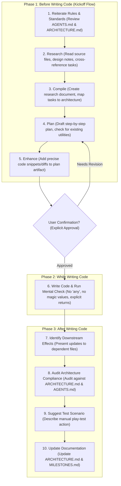

# AGENTS.md — Roguelike Project (TypeScript + ROT.js + Vite)

*This document is the source of truth for Code Standards, General Rules, and Workflows.*

## 0. Golden Rules

### Tool & Workflow Rules
1. **Prioritize built-in tools** over console commands (e.g., use file viewer tools rather than `cat` in bash).
2. **Never commit or push** to a git repository.
3. **Always keep tracking up to date.** Update task checklists and milestones immediately after completing a step, not just at the very end of the task.
4. **Consult artifacts first.** Always review existing artifacts (like research reports or design docs) when building a new plan.
5. **Wait for authorization.** Never move on to executing a plan or writing code before the User gives explicit approval.

### Communication Rules
6. **Prioritize communication over code.** Brainstorm extensively before committing to an architecture.
7. **NEVER assume. ASK.** If a task is ambiguous or under-specified, stop and ask clarifying questions. List any assumptions explicitly and ask the user to confirm them.
8. **Analyze bugs first.** When dealing with a bug, show the analysis and a fix plan, then ask the user for feedback before implementing it.
9. **Push back on bad design.** Do not blindly agree with the user. If a requested architecture is flawed, over-engineered, or wrong, point it out and propose alternatives with arguments. If instructions are perfect, execute them.

### Coding Rules
10. **NEVER hallucinate APIs.** If you are unsure if a function exists in ROT.js, Vite, or a dependency, refer to the docs or ask. Do not invent plausible API calls.
11. **NEVER use `any`.** There are zero acceptable uses of `any`. Use `unknown` + type narrowing, generics, or branded types.
12. **NEVER use magic values.** Every literal value affecting gameplay must be a named constant or enum member. No exceptions.
13. **Prefer SMALL changes.** Each response should address one logical change. Do not refactor unrelated code while implementing a feature.
14. **Avoid unnecessary nesting.** Keep code flat where possible. Use early returns to avoid deeply nested if/else blocks.

---

## 1. Agent Workflow & Process

### Workflow Visual Map

### Before Writing Code (The 5-Step Kickoff Flow)
When starting a new milestone or major feature, you MUST execute the following flow strictly in order:
1. **Reiterate rules and standards:** Acknowledge the core constraints (e.g., ECS purity, Data-Driven JSON, TypeScript strictness, no deep nesting, etc). Review `AGENTS.md` and `docs/ARCHITECTURE.md` first.
2. **Research:** Read the relevant source files, reference documents (archtecture, past and future milestones, specific spec or ideas docs, etc), and design notes. Cross-reference the milestone tasks with the existing codebase to discover exactly where and how changes must happen.
3. **Compile:** Before proposing a plan, summarize your findings into a concrete research document. Explicitly map each task to the specific architectural rules and design documents that govern it, calling out where existing code and systems interact with the new systems or functionality, if any.
4. **Plan:** Draft a initial step-by-step implementation plan based strictly on the compiled research. State open questions and request user feedback. Always check for existing utilities in `utils/`, `constants/`, and `types/` before proposing new ones to avoid duplication.
5. **Enhance:** Once the high-level initial plan is formed, do a second pass to enhance the plan artifact with precise code snippets (or diffs) demonstrating exactly how the logic will be integrated, *without* removing any of the underlying rules or justifications.

Wait for the User's confirmation before writing or modifying any actual codebase files.

### While Writing Code
6. **Run the check script mentally.** Before presenting code, verify:
   - No `any` types.
   - No magic literals.
   - All functions have explicit return types.
   - All switch statements are exhaustive.
   - No unused imports or variables.

### After Writing Code
7. **Identify downstream effects.** If you changed an interface or enum, list every file that will need to be updated and present those changes too.
8. **Audit Architecture Compliance.** Audit changes against `ARCHITECTURE.md` and `AGENTS.md` and provide a report on compliance.
9. **Suggest a test scenario.** Describe a manual play-test action the user can take to verify the change works.
10. **Update Documentation.** If the change added or modified a system, update `docs/ARCHITECTURE.md`. If a milestone was completed, summarize it and update `docs/MILESTONES.md`.

---

## 2. Project Overview

| Key              | Value                                           |
| ---------------- | ----------------------------------------------- |
| Genre            | Dual-mode traditional roguelike (Turn-based and RTwP, grid, ASCII)  |
| Language          | TypeScript (strict mode)                        |
| Roguelike Toolkit | ROT.js (rot-js on npm)                         |
| Package Manager  | bun                                             |
| Bundler          | Vite                                            |
| Target           | Modern browsers (ES2022+), deployed to itch.io  |
| Architecture     | Entity-Component-System (ECS-lite, no framework)|
| State Management | Immutable game state passed through turns        |

---

## 3. TypeScript Strictness & Style Guide

### Compiler Settings
The project uses the strictest possible TS config (`tsconfig.json`).
- `exactOptionalPropertyTypes: true`: You **cannot** explicitly assign `undefined` to an optional property (e.g., `foo: undefined` throws if the type is `foo?: string`). Omit it entirely or update the type.

### Type Discipline
- **Explicit Returns:** All function signatures must have explicit return types. Do not rely on inference.
- **Typed Parameters:** All parameters must be typed. No implicit `any`.
- **Shapes vs Unions:** Prefer `interface` for object shapes. Use `type` for unions/intersections.
- **Branded IDs:** Use branded types for IDs (e.g. `EntityId = number & { __brand: symbol }`) to prevent passing a MonsterID where an ItemID is expected.
- **Readonly Default:** Use `readonly` aggressively on properties and `ReadonlyArray<T>` on parameters.
- **`satisfies` over `as`:** Use `satisfies` to validate shapes without losing strict inference.
- **Exhaustive Switch:** Every `switch` on a union/enum must include a `default: return assertNever(x)` to force a compile error when adding new variants.
- **Intents & Discriminated Unions:** Missing a member in a discriminator enum (like `IntentType`) causes TS to fail type narrowing for the entire union. Check your enums if you see massive cascading `Argument of type X is not assignable to type Y` errors.
- **GameState Refactoring Cascades:** Changing the global `GameState` breaks almost every subsystem. Rely heavily on `.\verify.bat` to hunt down and fix these cascading breaks systematically.

### Style Guide
- **Add a JSDoc comment** to every exported function, type, and constant (`@param`, `@returns`, and description).
- **Name things precisely.** `processEntities` is bad. `applyMeleeDamage` is good.
- **Flat is Better than Nested.** In complex systems (parsing intents, applying consequences), use guard clauses (early returns or `break`s) and flat `switch` statements. Avoid deeply nested `if/else` chains.

---

## 4. ECS & Data Structure Constraints

- **Pure Components:** Components are plain data interfaces with no methods.
- **No Maps/Sets in ECS:** We must avoid using `Map` or `Set` objects inside ECS Components because the `GameState` (and therefore all components) must be fully serializable to JSON via `JSON.stringify`. Use plain objects (`Record<string, T>`) and arrays (`ReadonlyArray<T>`) inside components instead.
- **Strict Type Alignment:** JSON templates describe *classes* of things (like `string[]` for grudges), while components represent *instances*. Do not try to enforce `EntityId` inside a template. Match the JSON type (e.g. `string[]`) in the component.
- **ECS State Boundaries (Sleep/Wake):** When packing components for "cold storage", you must iterate over the components individually. Do not store references to the live `GameState.components` map; copy the component arrays to prevent memory leaks or reference contamination.
- **Entity Ownership & Foreign Keys:** Entities do not "contain" other entities; they only store `EntityId`s. When moving entities between floors/states, you must traverse and package all foreign keys (like inventory items) or risk leaving them orphaned.

---

## 5. Data-Driven & JSON Rules

- **The Default Campaign as the Feature Showcase:** The `default` campaign must represent ALL of the game's engine features. Whenever a new system is added (like Encounter Director, Schemes, Dialogues), the default campaign JSON files MUST be updated to actively use and showcase those features.
- **No Magic Values:** Every literal value affecting gameplay must be in a JSON registry.
- **Zod Validation:** All JSON data must conform to Zod schemas defined in `src/types/campaign.types.ts`.
- **Zod Inferred Types:** You must explicitly export the inferred TypeScript type (e.g., `export type AreaConnection = z.infer<typeof AreaConnectionSchema>;`) if other modules need to reference the shape.
- **Enums vs. Strings:** Prefer literal string IDs over TypeScript `enum`s for data definitions (e.g., `"stone_wall"`) for seamless JSON moddability.
- **Internal Constants:** Engine-internal constants that can't be data-driven go in `src/constants/`.
- **The Data Pipeline is Explicit:** Creating a new JSON registry requires explicitly updating `src/core/loader.ts` to `fetch()` it.
- **Zod Schemas Must Mirror Runtime Switches:** If the runtime `switch`es on a `type` string, the Zod schema **must** use `z.discriminatedUnion('type', [...])` with explicit param shapes. Do not use `z.record(z.string(), z.unknown())`.
- **Editor Dropdowns Must Derive from Canonical Sources:** Never hardcode dropdown options. Derive them from Enums, Zod, or CampaignData keys programmatically.
- **Never Duplicate Reference-Resolution Logic:** If two UIs need to resolve a reference (like populating an entity dropdown), extract it into a single utility.
- **Tag-Based Interactions:** Operating on `tags` rather than specific `itemId`s scales combinatorially. Always use tags for data-driven rules (reactions, triggers).

---

## 6. ROT.js & Determinism

- **Encapsulate ROT.js:** Do not use `ROT.FOV.*` or `ROT.Map.*` directly outside their project wrappers (`fov.ts`, `generator.ts`).
- **Strict Seed Determinism:** Never call `Math.random()` or `Date.now()`. You must use the shared `rng` instance exported from `src/core/rng.ts` and deterministic global counters (`nextEntityId`).
- **ROT.js TS Definitions:** In v2+, certain interfaces (like `DisplayOptions`) are not explicitly exported from `index.d.ts`. Use workarounds where necessary.

---

## 7. UI & View Layer Rules

- **UI Controller vs View Separation:** Split UI into DOM manipulation/state reading (Views) and DOM Event generation/Intents routing (Controllers). `main.ts` is for wiring, `input_handler.ts` for mapping, and `rendering/ui/` for Views.
- **DOM Injection & Security:** Avoid using `.innerHTML` for rich text parsing. Parse text into semantic segments and construct DOM nodes natively with `document.createElement()`.
- **Export Clashes in UI Barrel Files:** Be extremely careful not to double-export or accidentally overwrite exports in UI hubs like `src/rendering/ui.ts`, which can break routing silently.

---

## 8. Project Structure & Codebase Mapping

### Rules for File Organization
- **One concern per file.** Split files if they handle multiple responsibilities or exceed ~250 lines.
- **No circular imports.** The dependency graph flows DOWN: `main → core → systems → map/rendering → types/constants/utils`.
- **Barrel files (`index.ts`) are BANNED.** Use direct imports.
- **No Inline Imports in State Definitions:** Avoid `import('./file.ts').Type` inside core state interfaces. Explicitly import at the top of the file.

### Codebase Map Script
`scripts/map-codebase.ts` scans `src/` and prints exports. Use it as a reference for existing utilities.

---

## 9. Common Pitfalls — Do NOT

| ❌ Don't                                      | ✅ Do Instead                                     |
| --------------------------------------------- | ------------------------------------------------ |
| Use `any`                                     | Use `unknown`, generics, or proper types          |
| Use raw string keys for components            | Use the `ComponentType` enum                      |
| Call `Math.random()`                          | Use the shared `rng` instance from `rng.ts`   |
| Import from ROT.js directly in gameplay code | Use the project's wrapper modules      |
| Put rendering logic in a system               | Systems return state; renderer reads state        |
| Store derived state (e.g., visible tile cache)| Recompute in the render pass from FOV             |
| Mutate arrays/objects you don't own            | Clone or use immutable update patterns            |
| Skip the plan step for multi-file changes     | Always state the plan and get confirmation first  |
| Leak subsystem knowledge into the game loop   | Subsystems expose query helpers (e.g., `shouldSkipTurn()`) |
| Hardcode editor dropdown values               | Derive dropdown options programmatically           |

---

## 10. Reference Docs

### Internal
- **Architecture:** `docs/ARCHITECTURE.md` — subsystem descriptions and how the engine fits together.
- **Decision Log:** `docs/DECISIONS.md` — non-obvious architectural tradeoffs and their rationale.
- **Milestones:** `docs/MILESTONES.md` — roadmap, completed features, and upcoming work.

### External
- **ROT.js:** https://ondras.github.io/rot.js/hp/ and the GitHub wiki
- **TypeScript Handbook:** https://www.typescriptlang.org/docs/handbook/
- **Vite:** https://vitejs.dev/guide/
