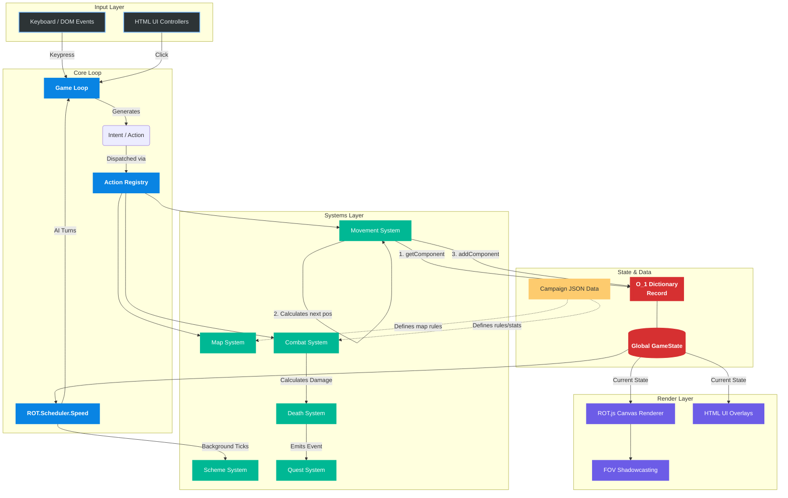

# Architecture — Roguelike Project

A traditional turn-based ASCII/grid roguelike game built for modern browsers.

---

## 1. Project Summary

This project is a grid-based traditional roguelike game featuring dual **Turn-Based** and **Real-Time with Pause (RTwP)** engine modes, built using TypeScript, ROT.js, and Vite. It runs natively in web browsers and is structured to compile efficiently and run deterministically. It uses an Entity-Component-System (ECS) architecture for managing game entities and state.

## 2. Core Design Philosophy

Beyond the technical ECS constraints, the development of systemic mechanics (like factions, quests, and background schemes) adheres to two primary philosophies:

- **Prioritize Observability**: Background simulations are notoriously difficult to debug because they fail silently. Never build an invisible system without a window into it. Complex simulation logic (like scheme advancement) must always be paired with explicit UI surfaces (investigation boards, dialogue logs) or dedicated `/debug` cheat commands so its state can be verified.
- **Defensive Simulation (Fail Gracefully)**: In systemic games, unpredictable edge cases *will* happen. If an intermediary NPC vital to a quest dies or is trapped, the simulation must not crash or soft-lock the campaign. Systems must handle broken chains gracefully—either by generating a new NPC to fill the role, or by explicitly failing the quest and rendering the failure in the UI.

---

## 3. Module Dependency Graph

The dependency graph flows strictly downward. Circular imports are banned. Modules at lower layers (e.g., `types`, `constants`, `utils`) may never import from upper layers. 

Since the Campaign Editor is a top-level creator tool rather than a part of the active gameplay loops, the `editor/` controller folder sits at the top tier of the graph alongside the game bootstrap, permitting it to import from any engine layer while keeping the `rendering/` view layer completely isolated.

**Top-Level Tooling Orchestration:** To respect downward dependency constraints, developer tools and builders that coordinate multiple systems (like the map generator, AI behaviors, and dialogue trees) must reside in a dedicated `src/editor/` namespace at the top tier of the graph rather than in lower view layers like `src/rendering/`. The UI view layer remains a dumb component tree that only communicates upward via event dispatching.

---

## 4. Engine Architecture

### 4.1 ECS-lite

We use a low-overhead, framework-free ECS:
- **Entities** are simple numeric IDs (`EntityId` branded type), not class instances.
- **Components** are pure data objects (TS interfaces) with no methods, stored in a `ReadonlyMap<EntityId, Readonly<Record<string, Component>>>` within the global `GameState` for `O(1)` access. The `GameState` is strictly immutable; systems clone the outer map when adding/removing entities, but only clone and replace the specific dictionary for the modified entity during updates.
- **Systems** are pure functions that query components using `getComponent`, process game state changes, and return new state via `addComponent` / `removeComponent`.
- **Entity Ownership**: Components (like `InventoryComponent`) do not "contain" other entities; they store `EntityId`s as foreign keys. When migrating entities between state boundaries, the engine must traverse and package these owned "child" entities to prevent orphaned references.

### 4.2 Game Loop & Scheduler

Turn management uses `ROT.Scheduler.Speed` (wrapped in `src/core/scheduler.ts`), chosen over `ROT.Scheduler.Simple` to support varied entity speeds (haste, slow, weapon weight) without future refactoring. Input is decoupled from the engine: keyboard and DOM listeners push `Intents` into an entity's Command Queue. When an entity's turn arrives via `act()`, it pops from the queue or calls `engine.lock()` to await input — enabling seamless RTwP and future multiplayer without restructuring the engine loop.

### 4.3 Intent → Action → Event Pipeline

All interactions flow through pure data `Intents` pushed into command queues, resolved by a stateless `ActionRegistry` mapping `IntentType` → `ActionHandler`. This replaces OOP Command objects (which would put method closures into the serializable `GameState`) while providing the same architectural decoupling without a massive `switch` router.

All entity interactions funnel through a single `ApplyIntent` carrying a `verb` (e.g., `apply`, `kick`, `zap`), optional `toolEntityId`, and a polymorphic target — replacing bespoke intents like `InteractIntent` and `UseItemIntent`.

### 4.4 Determinism & RNG

A single seeded `ROT.RNG` instance is exported from `src/core/rng.ts`. All gameplay randomness (map generation, combat rolls, AI choices) must use this instance to guarantee that any two players with the same seed and input sequence experience the exact same game state.

### 4.5 Save & Persistence

- **State Serialization**: The immutable `GameState` contains all active data, making serialization to JSON for `localStorage` via `src/core/save.ts` trivial.
- **Inactive Areas**: Non-active areas are stored in a compressed/serialized format within `GameState` and swapped into active ECS arrays upon transitions, keeping active queries lightweight.
- **Campaign Data**: Stored as JSON files loaded via `fetch()`. A global `campaigns.json` registry lists all available campaigns. `zod` schemas validate all data, giving precise human-readable errors for malformed mods.
- **JSON Patch Caveat**: JSON Patches (RFC 6902) work for editor change tracking, but gameplay turn-rewinding requires checkpointing `src/core/rng.ts` state alongside delta patches, otherwise future random results desync.

---

## 5. World & Map Systems

### 5.1 Map Generation & FOV

- **Generator**: Uses `ROT.Map.Digger` wrapped in `src/map/generator.ts`. The tile grid is stored as a flat array (`Tile[]`) with index math (`y * width + x`) for faster JS engine performance and trivial serialization. Tiles reference string IDs (e.g., `"stone_wall"`) resolved from a shared `TILE_REGISTRY`, decoupling rendering and mechanical properties from map structure.
- **FOV**: Shadowcasting is computed via `computeFOV` in `map.system.ts` only when `GameState.fovNeedsUpdate` is set (e.g., player moves, door opens). Results are cached in `GameState.cachedFov`.
- **Spatial Rendering**: The renderer uses an `O(1)` spatial index (`GameState.spatialIndex`) combined with `cachedFov` to draw only entities within camera bounds and line-of-sight.

### 5.2 Areas, Transitions & Sleep/Wake

The game world is divided into distinct "Areas" — procedural dungeons or static hand-crafted hubs. `GameState` tracks `currentAreaId`; inactive areas are serialized into an `areas` map. Transitions use generic `PortalComponent`s and a `ChangeAreaIntent`, packing the current ECS into cold storage and unpacking (or generating) the target area.

**Persistent Entities (Sleep/Wake):** Entities with a `PersistentComponent` are saved into a global `persistentEntities` pool (rather than area-local storage) when unloading, and re-injected into the active ECS when their target area loads. This ensures named NPCs maintain state across transitions and can migrate between areas.

### 5.3 Encounter Director

- **Algorithmic Population**: Hooks into map generation to spend "CR budgets" deterministically across tactical axes: objectives (proteins), advantages (appetizers), hazards (sides), and chaos (desserts).
- **Dynamic Content**: Enemy templates and features are scaled using trait costs and sub-biome tags, making procedural rooms feel authored.
- **Scheme Mutability**: Villain schemes can mutate Director parameters (adding encounters, shifting budgets) before generation, providing macro-level world consequences.

---

## 6. Combat & Entity Systems

### 6.1 Unified Damage Pipeline

All damage sources (melee, traps, spells, environment) inject a `DamageComponent` onto the target containing `DamageInstance`s with `amount`, `sourceEntityId`, and semantic `tags` (e.g., `["spell", "lightning"]`). `damage.system.ts` aggregates damage, reduces HP, processes on-hit effects, and generates floating combat text. If HP reaches 0, a `DeathComponent` is attached; `death.system.ts` handles messages, XP, drops, and cleanup. This fully decouples the *cause* of damage from its *resolution*.

### 6.2 Status Effects Engine

A declarative `StatusEffectDefinition` registry describes effects (duration, stat modifiers, per-turn damage/heal, behavior flags). `status-effect.system.ts` ticks every turn, removing expired effects and modifying stats via `getEffectiveStats()`. Behavioral flags describe *mechanics* (`skipTurn`, `confused`), not *flavor* (`stunned`, `frozen`) — so any number of thematic variants reuse `skipTurn: true` without code changes. The game loop queries generic helpers like `shouldSkipTurn()` and never inspects specific effect names.

### 6.3 Items, Equipment & Stat Model

- **Registries**: Items and Effects are defined declaratively in JSON as pure data objects keyed by string ID, enabling trivial serialization and future modding.
- **Inventory**: The player's `InventoryComponent` holds item `EntityId`s. Pickup removes `PositionComponent`; drop restores it.
- **"Bonus at Query Time"**: Equipment bonuses are *never* baked into `FighterComponent`. `getEffectiveStats()` dynamically sums base stats with equipment and status effect bonuses on demand, preventing desyncs from forced item removal and composing cleanly with future modifiers (level-ups, curses).

### 6.4 Reactions & Triggers

- **Reaction System**: `reaction.system.ts` evaluates `reactions.json` against source/target entities, matching on `tags` and `verbs` rather than entity IDs — enabling designers to author new mechanics entirely in data. Matched reactions delegate to the Trigger System for consequence execution (e.g., `change_area`, `apply_item_effect`, `emit_event`).
- **Trigger System**: `trigger.system.ts` executes data-driven `TriggerDefinition`s (`WHEN [event] IF [conditions] THEN [consequences]`), routed via pre-sorted buckets for `O(1)` event-type matching.
- **Interactive Terrain**: Doors, traps, shallow water, and other terrain features define interactions and movement costs directly in JSON definitions.

---

## 7. AI & Social Layer

### 7.1 Composable AI Pipeline & Factions

AI logic is split into discrete modules (`hunt`, `flee`, `ranged`, `wander`) composed into data-driven AI Profiles. During an entity's turn, behaviors are evaluated in priority order until one returns an executable `Intent` — replacing monolithic `if/else` blocks and allowing complex types (e.g., cowardly mage) to be built by mixing behaviors in data. Hostility is resolved via a `HOSTILITY_MATRIX` lookup between `FactionId`s, replacing hardcoded "player vs monster" logic and enabling infighting, neutral NPCs, and allied summons. AI modules utilize FOV for line-of-sight checks, and `AIComponent` tracks ability cooldowns.

**Memory Separation of Concerns**: AI combat tracking data (like `grudges`) is kept strictly separated from narrative state tracking (like boolean `facts` for dialogues). Mixing them creates brittle code that can falsely trigger AI hostility.

### 7.2 Identity, Personality & Chronicle

- **Chronicle & Memory**: Important NPCs have a `ChronicleComponent` tracking player interactions, scars, relationships, and history. `MemoryComponent` stores `knowledge` (rumors, locations), `interaction counters`, and `personality facets`.
- **Identity Generation**: Promoted NPCs receive `IdentityComponent` via data-driven tables keyed by `{templateId}_identity` convention (e.g., `"orc"` → `"orc_identity"` in `identity_generation.json`).
- **Personality**: NPCs possess values, goals, and facets (cowardice, generosity). Extreme memories mutate facets permanently as "core memories". Personality weights AI behavior selection and gates dialogue options.

### 7.3 Dialogue, Quests & Knowledge Brokering

- **Dialogues**: JSON trees (`DialogueTreeSchema`) with conditional gating against `MemoryComponent` (faction standing, grudges, personality). Options dispatch configurable effects via the trigger system.
- **Quests**: Data-driven structures with observable objectives tracked via `QuestLogComponent`. Subsystems emit generic events that `quest.system.ts` listens to, decoupling combat from quest logic. Supports `AND`/`OR` logical operators for branching resolutions.
- **Knowledge**: NPCs learn about world events through delayed propagation in the social graph. The player uses dialogue verbs (`ask_about`, `gossip`) to acquire knowledge dynamically. Rumors spread organically and decay over time.

### 7.4 Trade & Barter Economy

Entities with a `ShopComponent` act as merchants. `getEffectivePrice` dynamically evaluates NPC markup, faction standing, personality facets, and social states (`annoyed`/`grateful`). Social verbs (`intimidate`, `persuade`) use personality-weighted contests to temporarily modify pricing. Depleted inventories generate procedural fetch quests via the existing quest template system.

### 7.5 Scheme Simulator & Investigation

`scheme.system.ts` ticks independently within the `ROT.Scheduler.Speed` loop. Villains pursue JSON-defined `SchemeDefinition`s containing sequential phases and `AgreementDefinition`s to recruit minions. As the player defeats minions, combat drops randomized clues; `investigation.system.ts` updates the `investigation` object on `GameState`, exposed via the Investigation Board UI. Schemes feature dynamic resilience: recruitment utilizes MICE-based profiling mapped to NPC personality facets, node disruption triggers local repair and confession logic based on `compromiseScore`, and escalating countermeasures trigger via `conspiracyAwareness`. Schemes survive mastermind deaths by transferring ownership and continuing in a leaderless momentum state.

### 7.6 Rivalry & Power Struggles

`rivalry.system.ts` provides autonomous background conflicts for persistent entities. The system allows entities to form rivalries, scheduling resolutions (like duels or betrayals) after a delay. Outcomes of rivalries (such as death, promotion, or status effect changes) deterministically resolve off-screen and propagate as `RivalryResolved` events.
This connects to the knowledge and gossip systems: major power shifts result in rumor propagation (`gossip.system.ts`) and add verifiable knowledge (`knowledge.system.ts`) to NPCs. Trade mechanics (`trade.ts`) also reflect rivalry impacts by imposing markup penalties on merchants whose suppliers suffer vacancies in the top-tier hierarchy.

---

## 8. Rendering & UI

- **Renderer**: Translates tiles and entities into characters/colors on `ROT.Display`.
- **Camera**: Handles viewport offsets, keeping the player centered on maps larger than the screen.
- **UI & HUD**: HTML overlays (health, logs, status) in modularized `src/rendering/ui/`, acting as a pure "dump" View layer decoupled from ECS logic.
- **Styling**: CSS modularized by domain in `src/styles/`, aggregated via `@import` in `index.css`.
- **View Controls**: CSS 3D transforms (Rotate 45°, 3D Tilt) on the canvas wrapper for 2.5D visuals without complicating the 2D renderer.
- **Aspect Ratio & Zoom**: Controlled programmatically by syncing `ROT.Display` grid dimensions and font size. Aspect ratio constants are injected as a CSS custom property `--game-aspect-ratio`. Resizing expands the display grid to fit viewport constraints, avoiding letterboxing.

---

> **📋 Key design decisions and their detailed rationale are documented in [DECISIONS.md](./DECISIONS.md).**
