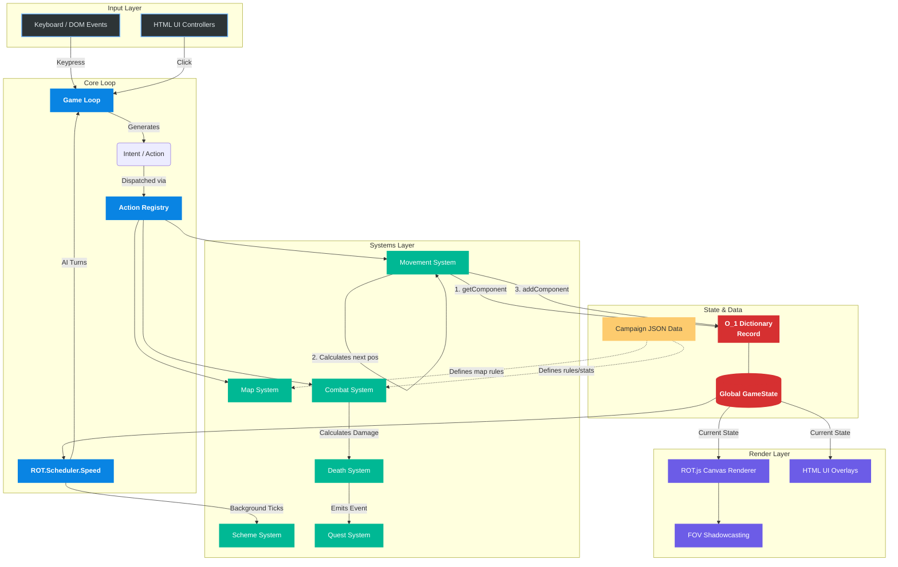

# Architecture — Roguelike Project

A traditional turn-based ASCII/grid roguelike game built for modern browsers.

---

## 1. Project Summary

This project is a grid-based traditional roguelike game featuring dual **Turn-Based** and **Real-Time with Pause (RTwP)** engine modes, built using TypeScript, ROT.js, and Vite. It runs natively in web browsers and is structured to compile efficiently and run deterministically. It uses an Entity-Component-System (ECS) architecture for managing game entities and state.

## 2. Core Design Philosophy

Beyond the technical ECS constraints, the development of systemic mechanics (like factions, quests, and background schemes) adheres to two primary philosophies:

- **Prioritize Observability**: Background simulations are notoriously difficult to debug because they fail silently. Never build an invisible system without a window into it. Complex simulation logic (like scheme advancement) must always be paired with explicit UI surfaces (investigation boards, dialogue logs) or dedicated `/debug` cheat commands so its state can be verified.
- **Defensive Simulation (Fail Gracefully)**: In systemic games, unpredictable edge cases *will* happen. If an intermediary NPC vital to a quest dies or is trapped, the simulation must not crash or soft-lock the campaign. Systems must handle broken chains gracefully—either by generating a new NPC to fill the role, or by explicitly failing the quest and rendering the failure in the UI.

---

## 3. Module Dependency Graph

The dependency graph flows strictly downward. Circular imports are banned. Modules at lower layers (e.g., `types`, `constants`, `utils`) may never import from upper layers. 

Since the Campaign Editor is a top-level creator tool rather than a part of the active gameplay loops, the `editor/` controller folder sits at the top tier of the graph alongside the game bootstrap, permitting it to import from any engine layer while keeping the `rendering/` view layer completely isolated.

---

## 3. Major Subsystems

### Entity-Component-System (ECS-lite)
We use a low-overhead, framework-free ECS:
- **Entities** are simple numeric IDs (`EntityId` branded type), not class instances.
- **Components** are pure data objects (TS interfaces) with no methods. They are stored in a `ReadonlyMap<EntityId, Readonly<Record<string, Component>>>` within the global `GameState` for `O(1)` access.
- **Systems** are pure functions that query components using `getComponent`, process game state changes, and return new state via `addComponent` / `removeComponent`.

### 4. Event Routing Buckets
Rather than having global Event Listeners or looping `O(N)` queries every frame (e.g., checking all quests when an entity dies), we rely on cached inverted indexes (buckets) stored directly on the related components (e.g., `QuestLogComponent.activeTriggers`).
*Decision:* This turns an `O(Quests * Objectives)` operation into an `O(1)` map lookup during high-frequency combat events, isolating the performance cost only to the moment a quest is granted or completed.

### 5. Strict Seed Determinism
The game relies entirely on a shared `ROT.RNG` instance and strict global counters (`nextEntityId`, `nextQuestId`).
*Decision:* No system is permitted to use `Math.random()` or `Date.now()`, even for string ID generation. This guarantees that any two players with the same seed and input sequence will experience the exact same game state.

### Map Generation & FOV
- **Generator**: Uses `ROT.Map.Digger` wrapped in `src/map/generator.ts` to create standard room-and-corridor layouts.
- **FOV Computation**: FOV shadowcasting is computationally expensive. It is calculated via `computeFOV` in `map.system.ts` but *only* when the `GameState.fovNeedsUpdate` flag is set (e.g. when the player moves or when terrain visibility changes). The results are stored in `GameState.cachedFov`.
- **Spatial Rendering**: The renderer uses an `O(1)` spatial index (`GameState.spatialIndex`) combined with `GameState.cachedFov` to draw only entities actively inside the camera bounds and in line-of-sight, eliminating the need to globally query and sort thousands of entities every frame.

### Turn Scheduler
Turn management is wrapped in `src/core/scheduler.ts` using `ROT.Scheduler.Speed`. This speed/energy-based scheduler handles entities with varying speeds (e.g., fast monsters moving twice as often as the player).

### Random Number Generator (RNG)
A single seeded `ROT.RNG` instance is exported from `src/core/rng.ts`. All gameplay randomness (map generation, combat damage rolls, AI choices) must use this instance to enable deterministic replays and debugging.

### Rendering & Camera
- **Renderer**: Translates map tiles and entities into characters and colors drawn on `ROT.Display`.
- **Camera**: Handles camera scrolling/viewport offsets, keeping the player centered when maps are larger than the screen dimensions.
- **UI & HUD**: Draws HTML overlays (health bars, logs, status) surrounding the main canvas. This layer is fully modularized (`src/rendering/ui/`) and acts purely as a "dump" pattern View layer, decoupled from ECS update logic.
- **Styling**: CSS is modularized by domain in `src/styles/` (layout, HUD, modals, etc.) and aggregated via `@import` in `index.css`.
- **View Controls**: Implements dynamic CSS 3D transforms (Rotate 45° and 3D Tilt) on the canvas wrapper to achieve a flexible 2.5D visual style without complicating the underlying 2D ROT.js renderer.

### Items & Inventory
- **Registries**: Items and Effects are defined declaratively in JSON registries and loaded into the `GameState`. They are pure data objects keyed by string IDs.
- **Inventory System**: The player has an `InventoryComponent` holding references to item `EntityId`s. Picking up an item removes its `PositionComponent` (taking it off the map); dropping it restores it.
- **Equipment & Stats**: Equipment modifies stats dynamically at query time via `getEffectiveStats()` and `getEffectiveCapacity()`, rather than mutating base values on `FighterComponent` or `InventoryComponent`.
- **Item Effects**: Consumable effects are dispatched by `effects.system.ts` based on their declarative definitions.

### Unified Combat Pipeline
- **Damage Components**: All forms of damage (melee, traps, spells, environmental) inject a `DamageComponent` onto the target containing an array of `DamageInstance`s. These instances hold the `amount`, `sourceEntityId`, and semantic `tags` (e.g., `["spell", "lightning"]` or `["trap", "physical"]`).
- **Damage System**: The `damage.system.ts` processes all instances across all entities. It aggregates damage, reduces HP, processes on-hit status effects, and generates floating combat text.
- **Death System**: If `DamageSystem` reduces an entity's HP to 0, it attaches a `DeathComponent` storing the `killerId` and `causeOfDeath` (derived from tags). `death.system.ts` runs directly after, handling death messages, XP distribution, item dropping, and cleanup.
- **Rationale**: This fully decouples the *cause* of damage from the *resolution* of damage, allowing traps, AI abilities, and items to simply emit a generic component rather than manually subtracting HP and managing Game Over states.

### Status Effects Engine
- **Declarative Effects**: A declarative `StatusEffectDefinition` registry describes the effect behavior (duration, stat modifiers, per-turn damage/heal, and flags like `stunned` or `skipTurn`).
- **Processing**: The `status-effect.system.ts` processes these ticks every turn, removing expired effects and modifying stats dynamically in conjunction with `getEffectiveStats()`.

### AI Pipeline & Factions
- **Composable Behaviors**: AI logic is split into discrete modules (`hunt`, `flee`, `ranged`, `wander`). These are composed into data-driven AI Profiles (e.g., `MeleeAggressive`, `RangedArcher`).
- **Faction Matrix**: Hostility is determined by looking up `FactionId`s in a `HOSTILITY_MATRIX`, replacing hardcoded "player vs monster" logic to allow infighting and neutral NPCs.
- **Line of Sight & Cooldowns**: AI modules utilize the FOV system (`computeFOV`) to ensure they only attack visible targets, and the `AIComponent` statefully tracks ability cooldowns to prevent spell spam.

### Dialogue Engine & The Social Layer
- **Data-Driven Dialogues**: Dialogues are defined as JSON trees (`DialogueTreeSchema`), mapping nodes and branching options. This decouples conversation logic from code, allowing rich interactions via simple configuration files.
- **Conditional Gating**: Dialogue options dynamically evaluate conditions against the NPC's `MemoryComponent` (e.g., faction standing, grudges) or global state to determine availability.
- **Event Emission**: Selecting dialogue options dispatches configurable effects or generic `emit_event` actions, fully integrating conversations into the event-driven ECS without tight coupling.
- **Declarative Quests**: Quests are data-driven structures with multiple observable objectives (e.g., kill X monsters, talk to Y NPC). Progress is tracked via a `QuestLogComponent`.
- **Event Hook Integration**: Subsystems (like combat/death) emit generic events that the `quest.system.ts` listens to, ensuring that objectives are updated without tightly coupling combat to quest logic.

### The Adversarial Layer (Scheme Simulator)
- **Background Execution**: The `scheme.system.ts` ticks independently within the `ROT.Scheduler.Speed` loop. Villains pursue objectives and dispatch minions without requiring player input or proximity.
- **Data-Driven Schemes**: Masterminds use JSON-defined `SchemeDefinition`s containing sequential phases and `AgreementDefinition`s to recruit minions.
- **Investigation Ledger**: Global scheme state is decoupled from localized entities. As the player interferes with villainous agreements (e.g., defeating minions), the combat system drops randomized clues. `investigation.system.ts` processes these events to update the `investigation` object on `GameState`, which is then exposed to the player via the Investigation Board UI.

### Save & Persistence
- **State Serialization**: The `GameState` is strictly immutable and contains all active data, making serialization to JSON for `localStorage` saving trivial via `src/core/save.ts`.
- **Inactive Levels**: Non-active floors are stored in a compressed/serialized format within the `GameState` and swapped back into active ECS arrays upon level transitions.

### Triggers & Interactive Terrain
- **Data-Driven Terrain**: Terrain features like doors and shallow water define interaction outcomes and movement costs directly in their JSON definitions.
- **Traps & Triggers**: Handled by `trigger.system.ts`, hidden entities like traps use a `TrapComponent` to process effects when a unit steps on them.

---

## 4. Decision Log

### State Mutability vs ECS Design
- **Decision**: Components are stored in a `ReadonlyMap<EntityId, Readonly<Record<string, Component>>>`. Systems clone the outer map when an entity is added/removed, but during state updates, they only clone and replace the specific dictionary for the modified entity.
- **Rationale**: The `GameState` must be strictly immutable to support simple serialization and state rewinding. Initially, we used `ReadonlyArray<Component>`, but this required expensive `O(N)` `.filter()` and `.find()` operations across the codebase. By shifting to an `O(1)` dictionary keyed by `ComponentType`, we preserve immutability while massively speeding up component access and modification operations.

### Event Routing Buckets
- **Decision**: Rather than having global Event Listeners or looping `O(N)` queries every frame (e.g., checking all quests when an entity dies), we rely on cached inverted indexes (buckets) stored directly on the related components (e.g., `QuestLogComponent.activeTriggers`).
- **Rationale**: This turns an `O(Quests * Objectives)` operation into an `O(1)` map lookup during high-frequency combat events, isolating the performance cost only to the moment a quest is granted or completed.

### Strict Seed Determinism
- **Decision**: The game relies entirely on a shared `ROT.RNG` instance and strict global counters (`nextEntityId`, `nextQuestId`). No system is permitted to use `Math.random()` or `Date.now()`, even for string ID generation.
- **Rationale**: This guarantees that any two players with the same seed and input sequence will experience the exact same game state, which is a foundational requirement for traditional roguelikes.

### Flat Array for Tile Map
- **Decision**: We store the map's tile grid in a single flat array (`Tile[]`) rather than a 2D array (`Tile[][]`).
- **Rationale**: Index mathematics (`index = y * width + x`) is faster in JavaScript engine runtimes, avoids nested array checks, and makes state serialization/saving trivial.

### Speed Scheduler as Default
- **Decision**: We use `ROT.Scheduler.Speed` from day one rather than `ROT.Scheduler.Simple`.
- **Rationale**: While slightly more complex to set up, it enables varied entity speeds (haste, slow, weapon speed weights) without requiring a major refactor of the turn engine later.

### Encapsulated ROT.js Wrappers
- **Decision**: No direct `ROT.js` usage is allowed in systems or rendering modules. All calls must pass through custom project wrappers (e.g., `fov.ts`, `generator.ts`, `scheduler.ts`, `rng.ts`).
- **Rationale**: Minimizes coupling with the external library. If we decide to swap out ROT.js or upgrade to a version with breaking changes, the modifications are localized to single files.

### Data-Driven Tile Registry
- **Decision**: Map tiles reference string IDs (e.g., `"stone_wall"`, `"stone_floor"`) instead of numeric or enum types, resolving their properties from a shared `TILE_REGISTRY` database.
- **Rationale**: This decouples tile rendering and mechanical properties (walkability, transparency) from the map structure itself. It makes it extremely simple to serialize and save maps, add new tilesets, and load tile configurations from external YAML/JSON configuration files without modifying core movement or rendering code.

### Status Effect Flags Describe Mechanics, Not Flavor
- **Decision**: Behavioral flags on `StatusEffectDefinition` describe the *mechanical effect* (e.g., `skipTurn`, `confused`) rather than the *flavor* (e.g., `stunned`, `frozen`, `asleep`). The game loop queries a generic `shouldSkipTurn()` helper and never inspects specific effect IDs or names.
- **Rationale**: If flags were named after flavor (like `stunned`), every new skip-turn variant (Freeze, Paralysis, Sleep) would require either a new flag plus code changes in the game loop, or overloading a misleadingly-named flag. By naming flags after their mechanical consequence, any number of flavor effects can reuse `skipTurn: true` in their data definition and the game loop handles them all identically without modification. This keeps domain-specific knowledge inside the status-effect system and its data registry, where it belongs.

### Persistent Level Transitions via State Swapping
- **Decision**: We store the maps and non-player entities of inactive levels in a `levels` dictionary on the global `GameState`, swapping them into active ECS arrays only when transitioning floors.
- **Rationale**: Keeps active ECS queries and rendering passes lightweight since they only iterate over entities on the player's current floor, while fully preserving the state and layout of visited floors for traditional roguelike progression.

### Pre-emptive Data-Driven Architecture
- **Decision**: We strictly avoid Object-Oriented inheritance (classes/subclasses) for game entities. We prefer string IDs over TypeScript `enums`, and we design Actions to emit generic `Intents` (events) rather than executing hardcoded logic directly.
- **Rationale**: This paves the way for our end-goal of Modding & Extensibility. By using a "Prefab" pattern (plain TypeScript objects that mirror JSON schemas) and an Event-driven action system, we ensure that logic is never "baked in" to the engine. This makes the transition to loading external `.json`/`.yaml` campaigns and content trivial later on.

### Engine Input Architecture (Command Queue vs Promises)
- **Decision**: We use a decoupled input architecture. Keyboard and Network listeners run entirely outside the `ROT.Engine` loop. They push "Intents" into an entity's Command Queue. When it's an entity's turn to `act()`, it simply pops from the queue or, if the queue is empty, calls `engine.lock()` to await input.
- **Rationale**: While `async/await` Promises are more idiomatic modern JavaScript, a decoupled queue makes transitioning to Real-Time with Pause (RTwP) or Multiplayer trivial in the future, as the engine doesn't inherently halt on `await` calls; it only pauses when explicitly commanded via `lock()`.

### Global Overrides vs O(N) Iteration
- **Decision**: For state alterations that affect an entire collection identically (e.g., revealing the entire map, global buffs, freezing time), we prefer adding a boolean flag/override property to the parent object (e.g., `GameMap.isFullyExplored`) rather than iterating and mutating every single child object.
- **Rationale**: Rebuilding large immutable arrays (like 4,000+ map tiles) is computationally cheap but causes massive memory allocation spikes, which eventually triggers Garbage Collection pauses. Using global override flags avoids allocation entirely and scales safely to massive maps.

### "Bonus at Query Time" Stat Model
- **Decision**: Equipment bonuses are *never* baked into `FighterComponent` or `InventoryComponent`. Instead, a utility like `getEffectiveStats()` dynamically sums the base stats with equipment bonuses on demand.
- **Rationale**: If we mutated base stats when equipping/unequipping, we risk desyncs or permanent stat damage if an item is forcibly removed or destroyed. By computing the sum at query time, we compose cleanly with future stat modifiers like level-up gains or magical curses without refactoring combat logic.

### Declarative Item Effects Registry
- **Decision**: Item effects are defined as pure data objects (`ItemEffectDefinition`) mapped by string ID (`ITEM_EFFECTS`). The effect processor (`effects.system.ts`) interprets this data rather than executing inline functions.
- **Rationale**: Function closures cannot be serialized or safely synced over a network. Data objects can be trivially serialized for save/load (M7) and ultimately moved out of TypeScript into JSON/YAML configuration files for Modding (M9).

### Entity Ownership and Foreign Keys
- **Decision**: The ECS flattens the entity hierarchy. Components (like `InventoryComponent` or `EquipmentComponent`) do not "contain" other entities; they only store their `EntityId` (effectively a foreign key). When migrating an entity between distinct state boundaries, the engine must manually traverse and package these owned "child" entities.
- **Rationale**: If we fail to resolve these foreign keys during a transition, the parent entity arrives in the new state holding IDs for items that were left behind in the previous state's arrays, resulting in soft-locks or missing components.

### Areas and Transitions
The game world is divided into distinct "Areas", which can be procedurally generated dungeons or static, hand-crafted hubs.
The `GameState` tracks the `currentAreaId`, while inactive areas are serialized into an `areas` map. When the player uses a transition portal, the current ECS state is packed into cold storage, and the target area is unpacked (or generated) and brought into the active ECS.

### Persistent Entities (Sleep/Wake Pipeline)
To allow certain entities (like named NPCs) to persist and maintain state (such as health, inventory, or memories) when the player is not in their area, the engine uses a Sleep/Wake pipeline:
1. **Sleep Phase:** When unloading an Area, any entity with a `PersistentComponent` is saved into a global `persistentEntities` pool on the `GameState`, rather than the Area's local storage.
2. **Wake Phase:** When loading an Area, the system checks the `persistentEntities` pool for any entities mapped to the incoming `targetAreaId`. Those entities are pulled from the pool and re-injected into the active ECS.
This ensures that persistent NPCs don't get trapped in a specific Area's serialized state and can potentially migrate between areas without breaking data integrity.

### Composable AI Behavior Pipeline
- **Decision**: AI logic is split into discrete, pure functions (behaviors like `hunt`, `flee`, `ranged`). Entities receive an `AIProfileId` referencing a data-driven list of behaviors. During an entity's turn, the pipeline evaluates these behaviors in priority order until one returns an executable `Intent`.
- **Rationale**: Replaces a monolithic `if/else` block with a pluggable architecture. It allows us to build complex entity types (e.g., a cowardly mage who flees and casts spells) purely by mixing and matching existing behaviors in data.

### Data-Driven Faction Matrix
- **Decision**: Entity hostility is resolved by looking up their respective `FactionId`s in a global `HOSTILITY_MATRIX`, rather than hardcoding "player vs monsters".
- **Rationale**: Lays the groundwork for complex relationships (e.g., monster infighting, neutral NPCs, allied summons) without littering combat code with explicit type checks. It easily extends into the Modding milestone, as the matrix can be loaded from JSON.

### Player Knowledge vs Physical Properties (ECS Domain Modeling)
- **Decision**: Information that represents the player's memory or global knowledge (e.g., whether an item type is "Identified") is stored as a global set on `GameState` rather than an `identified: boolean` flag on individual `ItemComponent` instances.
- **Rationale**: An ECS component should represent a localized physical property of an entity. The player's memory is not a physical property of the sword sitting on the floor. If we used an instance flag, using a "Scroll of Identify" would require iterating over and mutating every single item across all active and inactive dungeon levels (an O(N) operation that breaks the encapsulation of inactive floors). By modeling this as Global Player Knowledge, any rendering system can instantly check the global set without mutating entity instances. This also perfectly supports future features like "Amnesia" spells or pre-identified starting loadouts.

### Campaign Data Format & Validation
- **Decision**: Campaign data (entities, items, map tiles, effects, etc.) is stored as JSON files bundled in the application and loaded dynamically at runtime via `fetch()`. A global registry (`public/data/campaigns.json`) acts as the single source of truth for all available campaigns and their basic metadata. We use `zod` for defining schemas, which provides both runtime validation and TypeScript type inference. The built-in TS constants have been deleted, and all subsystems read registry data directly from the loaded campaign state (attached to `GameState`). The base game itself is just the `default` campaign.
- **Rationale**: JSON is universally supported and familiar to modders. The central `campaigns.json` registry allows the frontend to easily list and select campaigns without needing a dynamic backend to read directory contents. While `zod` adds ~50KB to the bundle, it provides an invaluable single source of truth for our data definitions, ensuring that malformed mod JSONs throw precise, human-readable errors immediately upon loading, rather than causing cryptic undefined behavior during gameplay.

### Data-Driven Polymorphism over Routing Logic
- **Decision**: When building scalable architectures (like our Intents/Actions system), avoid writing centralized "routing" logic (massive `switch` or `if/else` trees) that determines how a piece of data behaves based on its type. Instead, encode meta-properties directly into the data shape (e.g., adding `isImmediate: true` directly to an Intent interface). 
- **Rationale**: This respects the Open-Closed Principle, allowing new data types to be added without modifying the core engine loops.

### Token Pools over O(N) Verification (The "Bag" Pattern)
- **Decision**: When enforcing global limits (e.g., "spawn a maximum of 1 Unique Boss" or "only 3 Elite Guards per level"), do not run an O(N) loop over all existing entities to count them at query time. Instead, initialize a stateful data structure (a "bag" or "deck") containing tokens representing the allowed spawns. When an entity is spawned, its token is popped from the pool.
- **Rationale**: Pre-structuring the data avoids expensive loops during gameplay. If an entity's token is not in the bag, it physically cannot be drawn, providing 100% reliable limit enforcement for free. This elegantly handles both Uniques (N=1) and Extinction mechanics (N=50) with the exact same logic.

### Action Registry vs Instantiated Commands
- **Decision**: Instead of following the traditional OOP Command Pattern where the UI/AI instantiates class objects (`new WalkAction()`) containing `.execute()` closures and pushes them into the command queue, we split the pattern in half. We push pure data `Intents` into the queue, and use a stateless `ActionRegistry` (mapping `IntentType` -> `ActionHandler`) inside the engine to resolve them.
- **Rationale**: The `GameState` must remain 100% pure, serializable data to support seamless `localStorage` saving (and future multiplayer networking). If we placed objects with method closures into the command queue, we could no longer easily serialize the queue. The `ActionRegistry` provides the exact same architectural decoupling (removing massive `switch` routers from the engine) while completely preserving the strict data boundaries of the ECS.

### Save File Backwards Compatibility
- **Decision**: During development phases (pre-v1.0), there is strictly no need to concern ourselves with backwards compatibility for `localStorage` save files. When the `GameState` shape changes, old saves can be safely invalidated or discarded.
- **Rationale**: Writing complex migration scripts to preserve save states between rapidly evolving milestones wastes development time and increases bug surface area. The game should fail fast or discard old saves rather than attempting to load them into incompatible new structures.

### Modular View & Controller Separation for UI
- **Decision**: The HTML/CSS UI layer (`src/rendering/ui/`) is cleanly separated into domain-specific rendering functions (e.g. `hud.ui.ts`, `inventory.ui.ts`) and CSS files (`src/styles/hud.css`). `main.ts` purely handles DOM event bindings and intent dispatching, while `bootstrap.ts` and `input_handler.ts` handle game startup and keyboard mappings respectively.
- **Rationale**: A massive monolithic UI file inevitably leads to massive merge conflicts, cross-contamination of logic, and spaghetti CSS. By strictly separating the view code by domain and decoupling DOM event generation (Controller) from DOM mutation (View), the top layer of the application remains maintainable even as complex development tools are added.

### Discriminated Union Schemas for Data-Driven Dispatch
- **Decision**: Whenever the runtime engine dispatches behavior based on a `type` discriminator (e.g., `switch (condition.type)` in the trigger system, or `switch (behavior.id)` in the AI pipeline), the corresponding Zod schema must model this as a `z.discriminatedUnion('type', [...])` with explicit, named param shapes per variant — never as `z.record(z.string(), z.unknown())`.
- **Rationale**: Opaque param bags (`Record<string, unknown>`) push all structural knowledge into runtime `switch` cases, making it invisible to the type checker, the Campaign Editor's form renderer, and the validation pipeline. By encoding each variant's expected params directly in the Zod schema, we get: (a) the editor auto-generates the correct form fields per variant, (b) `tsc` enforces exhaustive handling when new variants are added, and (c) campaign data is validated at load time rather than failing silently at runtime. This is a direct application of the "Data-Driven Polymorphism over Routing Logic" principle.

### Tag-Based Interaction Rules
- **Decision**: Data-driven interaction systems (item reactions, crafting, conditional triggers) must operate on **tags** (category-level string identifiers from a `tagRegistry` on `CampaignData`) rather than on specific item or entity IDs. Tag references in campaign data are validated against the registry at load time.
- **Rationale**: Item-specific interaction rules (e.g., "if item is `amethyst` and target is `potion_of_booze`") produce a combinatorial explosion of brittle, non-composable entries — the same maintenance nightmare that makes NetHack's `eat.c` and `potion.c` impossible to extend. Tag-based rules (e.g., "if source has tag `gemstone` and target has tag `alcohol`") scale combinatorially in the designer's favor: adding one new tag to an item automatically grants it all existing interactions for that tag category, with zero new rules required.

### Editor-to-Engine Schema Parity
- **Decision**: The Campaign Editor's form renderers and dropdown generators must always derive their options programmatically from canonical sources (`GameEventType` enum values, `CampaignData` registry keys, Zod schema enum members). No handwritten, hardcoded lists of options are permitted in UI code.
- **Rationale**: Handcoded dropdown lists silently diverge from the engine whenever a new event type, entity, or registry entry is added. This creates a "phantom availability" problem where the engine supports a feature but the editor hides it, forcing designers to type raw strings with no validation. Deriving from canonical sources guarantees that the editor's surface area always matches the engine's capabilities.
