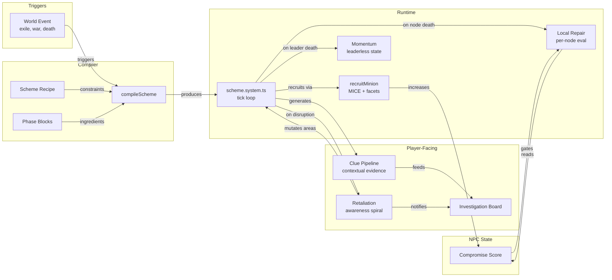

# Developer Handoff: Social Integration, Adversarial Layer 2.0 & V2 Engine Optimization

This document serves as an Architecture Decision Record (ADR) and hand-off guide for implementing the newly added milestones: the expanded Social/Reaction interactions (M19, M30, M32, M47), the Adversarial Layer Evolution (M52, M58), and the V2 Engine Asynchronous architecture (Phase 10: M64, M65).

## 1. Architectural Principles & Constraints
Before implementing these features, ensure adherence to the project's golden rules (see `AGENTS.md` and `ARCHITECTURE.md`):
- **Strict JSON Serialization**: The `GameState` must remain 100% JSON serializable. Do not use `Map` or `Set` in components, and do not attach class methods to components.
- **Data-Driven Design**: Hardcoding logic is prohibited. All conditions and effects must be evaluated through data defined in Zod schemas.
- **Strict Types**: Use exhaustive switch statements and discriminated unions.

---

## 2. Social Layer & Interaction Router (Milestones 19 & 47)
We are moving away from hardcoded hotkeys (like opening a barter menu directly via a keypress) towards a unified **Dialogue Data Router**.

### Goal
All NPC interactions—whether standard chatting, trading, or requesting a spell—should funnel through the `InteractIntent`. The engine will evaluate conditions and route the player to the appropriate UI or apply the correct effect.

### Expected Schema Additions
You will need to extend `campaign.types.ts` with discriminated unions for `DialogueCondition` and `DialogueEffect`.

**Example Zod Structure Target:**
```typescript
export const DialogueEffectSchema = z.discriminatedUnion('type', [
  z.object({ type: z.literal('grant_quest'), questId: z.string() }),
  z.object({ type: z.literal('open_barter') }),
  z.object({ type: z.literal('trigger_service'), serviceId: z.string() }),
  z.object({ type: z.literal('modify_standing'), factionId: z.string(), amount: z.number() })
]);
```

When processing `open_barter`, the system should check if the entity has a `ShopComponent` and summon `trade.ui.ts` seamlessly.

### Dynamic Hostility (Attitudes)
Instead of static faction checks in `ai.system.ts`, foes can become neutral or friendly. You will need to introduce an `AttitudeComponent` that records dynamic shifts in alignment triggered by `DialogueEffect`s or `Reaction`s.

---

## 3. Reaction System 2.0 & Static Inventories (Milestones 30 & 32)
### Environmental Tile-Based Reactions
Currently, `ReactionTargetMatcherSchema` only checks `entity` and `item` tags. We need true immersive sim capabilities (e.g., throwing a torch to ignite a floor tile).
- **Task:** Extend the matcher to accept `targetType: 'tile'`.
- **Implementation:** Modify `reaction.system.ts` to fetch tile definitions from `tiles.json` during resolution.

### Static Chest Inventories
Handcrafted campaigns require specific quest items to drop from specific chests.
- **Task:** Update `map.system.ts` to look for an `inventory: string[]` (array of item IDs) on objects defined in the `areas.json` `placedEntities` array. This must override procedural loot tables.

---

## 4. Phase 10: V2 Engine Optimization (Milestones 64 & 65)
Phase 10 is designed to make Real-Time with Pause (RTwP) completely fluid by offloading the ECS out of the main browser thread.

### Milestone 64: Cooperative Scheduler (Time-Slicing)
- **Problem:** Heavy procedural generation and Mastermind Scheme background simulations freeze the browser.
- **Solution:** Convert heavy functions to `function*` (generators). Build a wrapper around the `ROT.Scheduler` that checks `performance.now()`. If a frame budget (e.g., 4ms) is exceeded, `yield` back to the event loop.

### Milestone 65: Absolute Presentational Decoupling (Web Workers)
- **Architecture Shift:** The main thread becomes a "Dumb Renderer". The entire `GameState`, `ROT.Engine`, and all `src/systems/` move to a Web Worker.
- **Communication Pipeline:** 
  1. Main thread captures DOM/Canvas inputs and serializes them.
  2. Main thread `postMessage`s the input to the Worker.
  3. Worker processes the game tick.
  4. Worker serializes a **Presentational Snapshot** (e.g., `{char, fg, bg, x, y}` for the visible viewport) and `postMessage`s it back.
  5. Main thread updates the DOM/Canvas blindly based on the snapshot.

*WARNING: The Structured Clone Algorithm will fail if the payload contains functions or DOM nodes. The `GameState` serialization must be audited to ensure it remains perfectly flat data.*

---

## 5. Adversarial Layer 2.0 (Milestones 52 & 58)

This section specifies three categories of enhancements to the Adversarial Layer (Schemes, Investigation, AI Social):
1. **Scheme Compiler** — A new system for assembling schemes dynamically from modular parts
2. **Deepening Existing Systems** — Tactical improvements to recruitment, clues, and repair
3. **New Capabilities** — Compromise tracking, scheme momentum, and retaliation escalation

### 5.1 Scheme Compiler

#### Problem
Currently, `SchemeTemplate` objects define a fixed sequence of phases. The *who* and *where* are dynamic, but the overall narrative shape of every scheme must be pre-written in JSON. Schemes cannot emerge from world events.

#### Solution: Modular Phase Blocks + Recipe Constraints
Split the current monolithic `SchemeTemplate` into two layers:

**Layer 1: Phase Blocks (The "Ingredients")**
A `PhaseBlock` is a self-contained, reusable unit of scheme behavior (e.g., `recruit_muscle`, `destabilize_region`).
- Adds contextual binding rules (`areaTargeting`, `areaRequireTags`)
- Adds narrative metadata for clue generation (`narrativeVerb`, `evidenceTags`)

**Layer 2: Scheme Recipes (The "Menu")**
A `SchemeRecipe` defines the *shape* of a scheme without specifying exact phases.
- Declares trigger conditions (what world event activates this recipe).
- Declares sequence constraints (e.g., 1 recruitment, 1 disruption, 1 climax).
- Includes a fallback scheme if constraints cannot be met.

**The Compiler Function**
A pure function `compileScheme()` assembles a runtime `SchemeComponent` from a recipe + world state, returning a shape identical to a hand-authored scheme. Hand-authored schemes and compiled schemes will coexist seamlessly.

### 5.2 Deepening Existing Systems

#### MICE Recruitment via Personality Facets
- Cross-reference the villain's leverage preferences against the target NPC's `MemoryComponent.facets` to select the most effective leverage *for that specific target*.
- MICE leverage type maps to personality facets: `money → greed`, `ideology → zealotry`, `coercion → cowardice`, `ego → pride`.

#### History-Derived Scheme Triggers
- Use `ChronicleComponent` and game events to dynamically trigger scheme compilation (e.g. NPC exiled -> Revenge Scheme).

#### Deepening the Clue Pipeline
- Make clue generation *context-aware* by tying it to the `PhaseBlock`'s `narrativeVerb` and `evidenceTags`.
- Support forensic terrain tags via `reaction.system.ts`.

#### Local Repair Logic
- When a scheme node is destroyed, remaining nodes evaluate their `AgreementComponent` and personality to decide their fate locally (Abandon, Continue, Reroute, Confess).

### 5.3 New Capabilities

#### Compromise Tracking
- Add a `compromiseScore` field to `MemoryComponent` that increments as NPCs commit crimes.
- This score powers local repair decisions, blackmail recruitment, confession depth, and AI flee thresholds.

#### Scheme Momentum (Decoupled Execution)
- Decouple scheme execution from the mastermind's survival. When a mastermind dies, the scheme enters a `leaderless` state.
- Existing minions continue executing their missions independently.

#### Retaliation Escalation (The "Spiral")
- Track a `conspiracyAwareness` score on the `SchemeComponent` that increases as the player disrupts nodes.
- At awareness thresholds, trigger escalating retaliatory consequences (scouts → ambushes → assassins → desperation) integrated with the Encounter Director.

### 5.4 System Interaction Map

